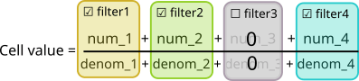
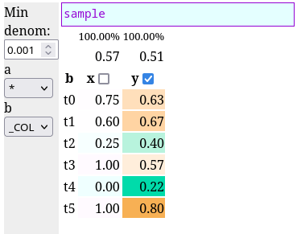

# numdenom

Converter from CSV files that have particularly named columns into interactive HTML tables.



## Example

```
$ cat sample.csv

a,b,x_num,x_denom,y_num,y_denom
qqq,t0,3,4,2,5
qqq,t1,3,5,1,2
qqq,t2,1,3,0,6
qqq,t3,4,4,2,4
qqq,t4,0,3,2,9
www,t0,0,0,3,3
www,t1,0,0,3,4
www,t2,0,1,4,4
www,t3,0,0,2,3
www,t5,1,1,4,5

$ ./numdenom.py sample.csv sample.html
```



## Algorithm

1. Read a CSV file and divide all its columns in two types: filter columns and value columns.
2. Value columns are pairs of columns named `x_num` and `x_denom`. They should only contain numbers. Filter columns are all columns not named like `*_num` or `*_denom`. Alternatively, there can be just `x_num` and a common, shared `denom` column. In the latter case the `denom` column becomes `N` column in the output table.
3. Output a HTML file that contains input file in a compressed form, along with some JavaScript code. The file is self-contained and can be opened using `file://` links.
4. Within the generated page, render all filter columns as combo-boxes on the left side. Each change of the filter settings recalculate the table.
5. For each value column, calculate the cell value by summing all `_num` values, then dividing it by the sum of `_denom` values. Rows not matching the filter settings are excluded from the sums. Special filter setting value `_COL` promotes filter column to show all its values separately as individual rows.

Value columns are sorted lexicographically. Content of filter columns is also sorted lexicographically. Order of the columns or rows within the CSV file does not matter.

## Additional features

* Cell values are subtly colorised to indicate where the value stands from column minimum to column maximum. Checking the checkbox near value column's name makes colorisation bright instead of subtle.
* When filtering some rows out, percentage above value column headers indicates share of remaining denominators.
* When `_COL` mode is used, averages are displayed at the top.
* Tool-tip shows specific aggregated numerators and denominators for each cell.
* Dark theme is supported (should trigger automatically when needed).
* You can set minimal denominator value to hide cells where aggregated denominator is too low.
* You can use URL fragment specifier like `#b=_COL` to provide initial filter settings (and other settings). URL fragment is updated automatically when you change settings.
* There is a feature to quickly display a chart of some column.
* Source CSV data can be extracted from the page.
* You can include additional information into the table as a collapsible section.

## Limitations

* Data are assumed to be reasonable, e.g. filter values should not be literally `_COL` or `*`. Quotation marks or commas can lead to problems with CSV round-trip.
* Missing value numbers are turned into `0`s.
* Additional command line arguments (table title and description file) are assumed to be trusted. You can include HTML there.

## Building and running.

You can download a pre-built `numdenom.py` from Github releases. The script is self-contained and is expected to depend only on Python's standard library.

Building `numdenom.py` requires Make and Typescript to be available and is performed by running `make` in the source code directory.
